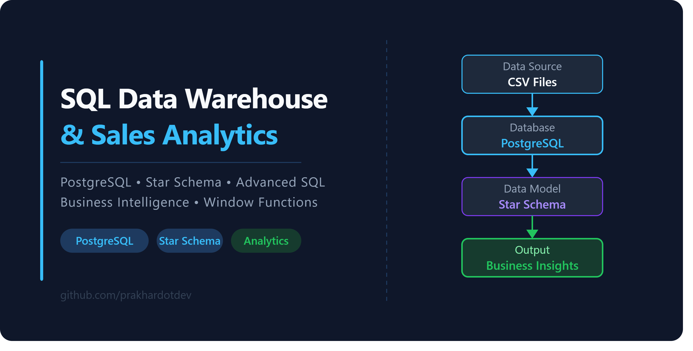
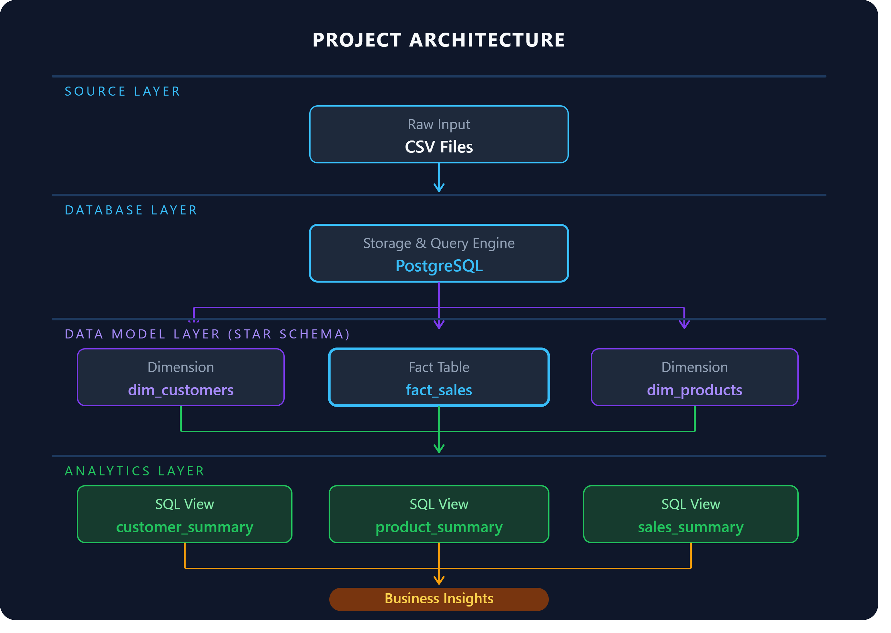
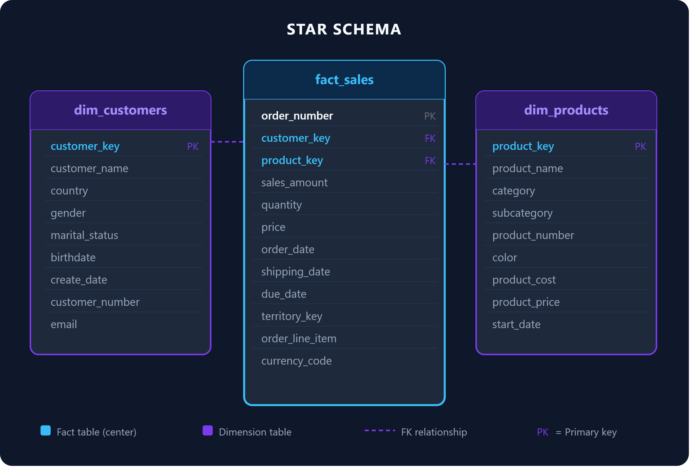
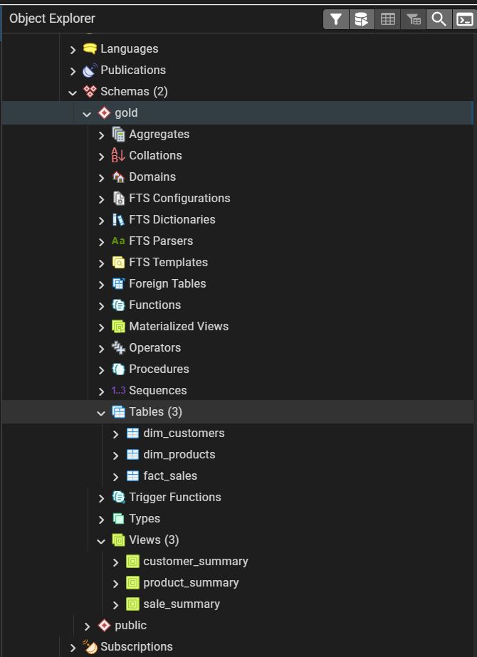
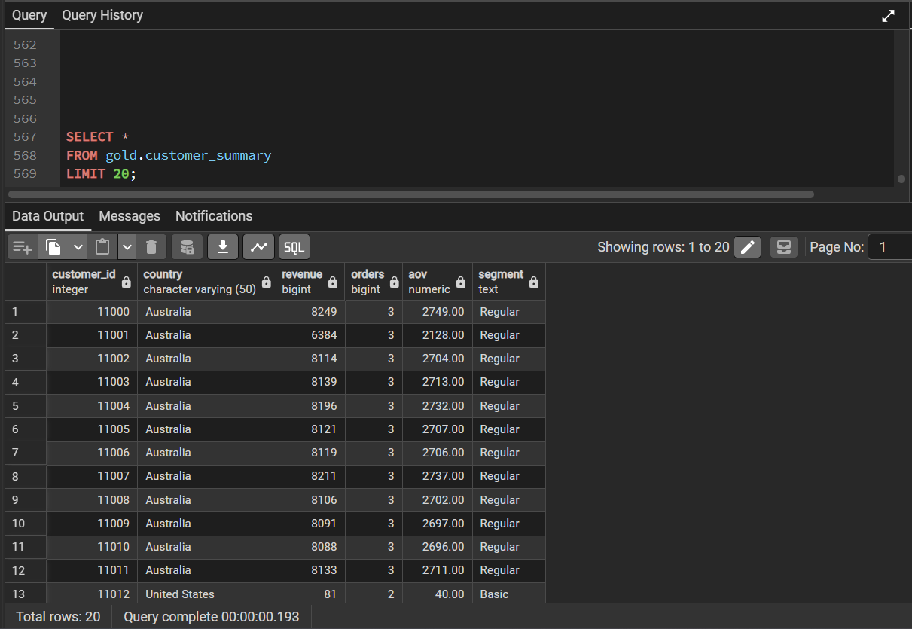
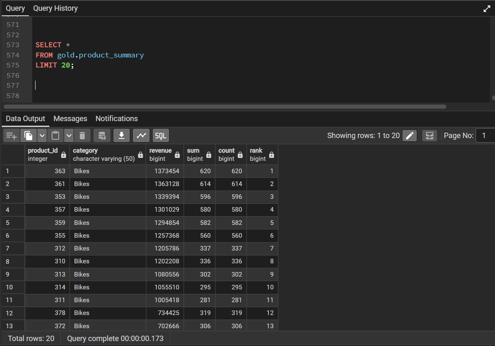
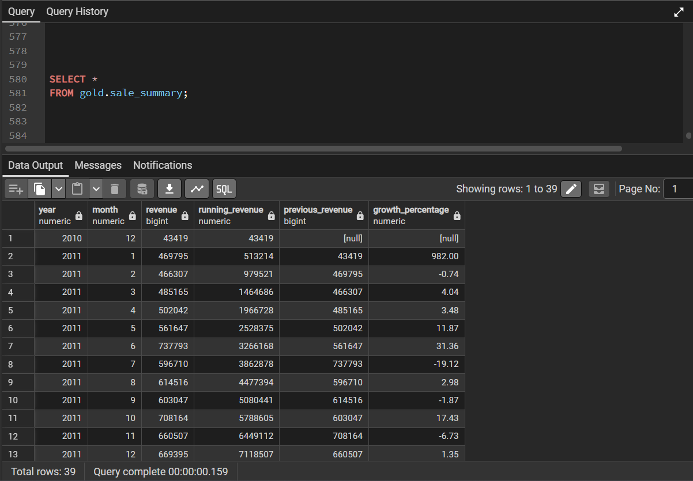
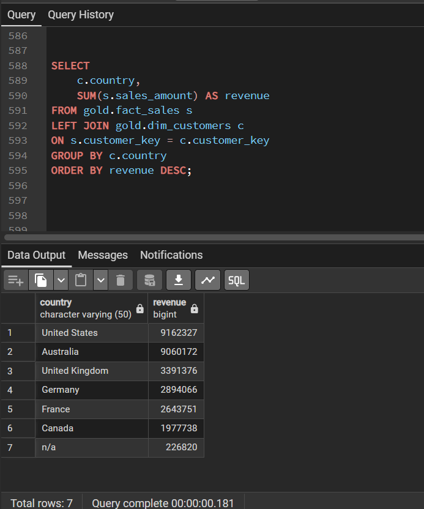
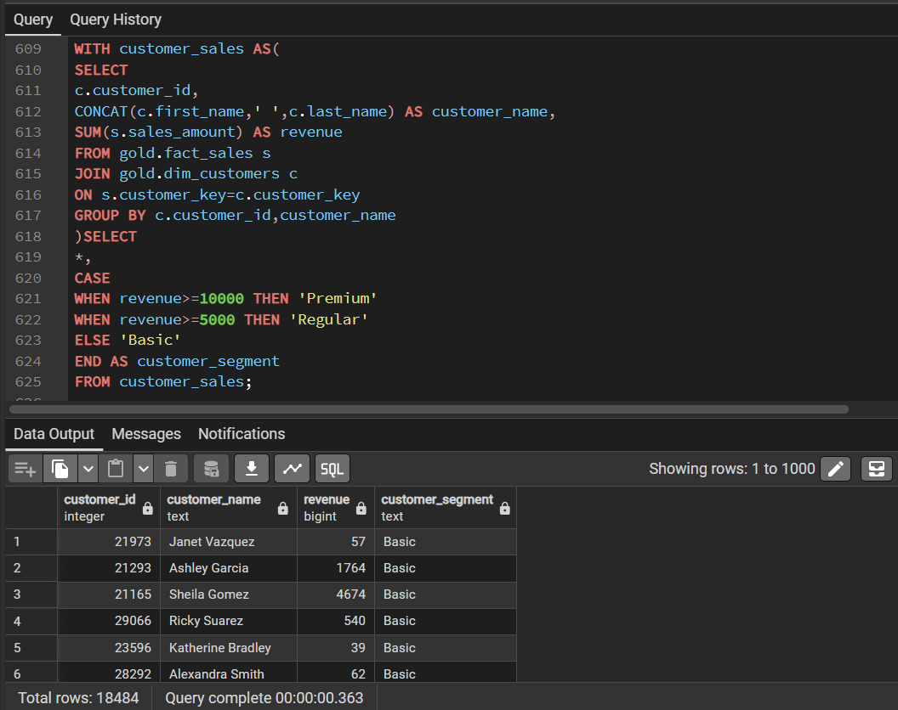

# SQL Data Warehouse & Sales Analytics

[](https://www.postgresql.org/)
[]()
[](https://www.pgadmin.org/)
[](https://github.com/prakhardotdev)
[](LICENSE)

An end-to-end data warehouse project built on PostgreSQL — transforming raw transactional sales data into structured business insights through star schema modeling, advanced SQL analytics, and reusable reporting views.

This project demonstrates how a data analyst approaches a real business problem: understanding sales performance, customer behavior, and product trends — without relying on any BI tool.

---

## Table of Contents

- [Overview](#overview)
- [Architecture](#architecture)
- [Data Model](#data-model)
- [Tech Stack](#tech-stack)
- [Repository Structure](#repository-structure)
- [SQL Concepts Used](#sql-concepts-used)
- [Business Questions Solved](#business-questions-solved)
- [SQL Views](#sql-views)
- [Key Insights](#key-insights)
- [Business Impact](#business-impact)
- [Skills Demonstrated](#skills-demonstrated)
- [What I Learned](#what-i-learned)
- [Challenges](#challenges)
- [Project Metrics](#project-metrics)
- [Screenshots](#screenshots)
- [Future Improvements](#future-improvements)
- [Author](#author)

---

## Overview

Most SQL projects stop at writing queries. This project goes further — it models the data properly, answers real business questions, and packages results into reusable views that can plug into any downstream tool.

**What this project covers:**

| Area | Details |
|---|---|
| Data Modeling | Star schema with one fact table and two dimension tables |
| Exploratory Analysis | Distribution, nulls, data quality checks |
| Business Analysis | Revenue, customer, product, and time-based analytics |
| Reporting Layer | Three production-ready SQL views |
| Insights | Actionable findings derived from the data |

---

## Architecture



The pipeline follows a straightforward flow — raw CSV files are loaded into PostgreSQL, organized into a star schema, analyzed with advanced SQL, and surfaced through views.

```
CSV Files
    ↓
PostgreSQL (Raw Load)
    ↓
Star Schema (fact_sales + dim_customers + dim_products)
    ↓
SQL Analytics (42 queries across 3 analysis scripts)
    ↓
SQL Views (customer_summary, product_summary, sales_summary)
    ↓
Business Insights
```

---

## Data Model



The project uses a **Star Schema** — the standard pattern for analytical workloads. A central fact table holds transactional records; dimension tables provide the descriptive context.

### fact_sales

The grain is one row per order line item.

| Column | Type | Description |
|---|---|---|
| order_number | VARCHAR | Unique order identifier (PK) |
| customer_key | INT | Foreign key → dim_customers |
| product_key | INT | Foreign key → dim_products |
| sales_amount | NUMERIC | Revenue for the line item |
| quantity | INT | Units sold |
| price | NUMERIC | Unit selling price |
| order_date | DATE | Date the order was placed |
| shipping_date | DATE | Date the order was shipped |
| due_date | DATE | Expected delivery date |

### dim_customers

| Column | Description |
|---|---|
| customer_key | Surrogate key (PK) |
| customer_id | Source system identifier |
| customer_number | Business key |
| first_name / last_name | Customer name |
| country | Geography |
| marital_status | Demographic |
| gender | Demographic |
| birthdate | Date of birth |
| create_date | Account creation date |

### dim_products

| Column | Description |
|---|---|
| product_key | Surrogate key (PK) |
| product_id | Source system identifier |
| product_number | Business key |
| product_name | Full product name |
| category | High-level grouping |
| subcategory | Detailed grouping |
| maintenance | Maintenance classification |
| cost | Product cost |
| product_line | Product line |
| start_date | Date product went live |

---

## Tech Stack

| Tool | Purpose |
|---|---|
| PostgreSQL | Primary database engine |
| pgAdmin | Query authoring and database management |
| SQL | All data modeling, analysis, and view creation |
| Git | Version control |
| GitHub | Repository and portfolio hosting |

---

## Repository Structure

```
sql-data-warehouse-analytics/
│
├── datasets/                    # Raw CSV source files
│
├── scripts/
│   ├── 01_database_setup.sql    # Database and schema creation
│   ├── 02_create_schema.sql     # Schema definitions
│   ├── 03_create_tables.sql     # Table DDL (fact + dimensions)
│   ├── 04_import_data.sql       # Data loading from CSV files
│   ├── 05_data_exploration.sql  # Exploration and data quality checks
│   ├── 06_business_analysis.sql # Core business queries
│   ├── 07_advanced_analysis.sql # Window functions, CTEs, segmentation
│   └── 08_create_views.sql      # View definitions
│
├── diagrams/                    # Architecture and schema diagrams
│
├── screenshots/                 # Query output screenshots
│
├── README.md
├── LICENSE
└── .gitignore
```

---

## SQL Concepts Used

<details>
<summary><strong>Foundation — Filtering and Aggregation</strong></summary>

| Concept | Used For |
|---|---|
| `SELECT`, `WHERE` | Row-level filtering across all analysis |
| `GROUP BY`, `HAVING` | Aggregating at customer, product, and time level |
| `ORDER BY` | Ranking outputs for business readability |
| `CASE` | Customer segmentation, revenue bucketing |
| Aggregate Functions | `SUM`, `COUNT`, `AVG`, `MIN`, `MAX` |
| `JOIN` | Linking fact table to both dimension tables |

</details>

<details>
<summary><strong>Advanced — Window Functions and CTEs</strong></summary>

| Concept | Used For |
|---|---|
| `WITH` (CTEs) | Breaking complex logic into readable steps |
| `ROW_NUMBER()` | Identifying the top customer per country |
| `RANK()` | Product and customer ranking by revenue |
| `LAG()` | Comparing current month revenue to prior month |
| Running Total (`SUM() OVER`) | Cumulative revenue over time |

</details>

<details>
<summary><strong>Reporting — Views</strong></summary>

Three production-ready views package the most valuable analytical outputs for reuse.

See the [SQL Views](#sql-views) section for full details.

</details>

---

## Business Questions Solved

The project answers 15 business questions across four domains.

### Revenue & Geography

| # | Question |
|---|---|
| 1 | Which country generates the highest total revenue? |
| 2 | What is the revenue contribution (%) by country? |
| 3 | Which product category drives the most revenue? |
| 4 | What is the revenue contribution (%) by category? |

### Time Intelligence

| # | Question |
|---|---|
| 5 | What is the monthly revenue trend over time? |
| 6 | What is the running (cumulative) revenue by month? |
| 7 | What was the revenue in the previous month? |
| 8 | What is the month-over-month growth percentage? |

### Customer Analytics

| # | Question |
|---|---|
| 9 | Who are the top 10 customers by revenue? |
| 10 | How much do the top 10 customers contribute to total revenue? |
| 11 | Who is the highest-revenue customer in each country? |
| 12 | How can customers be segmented by revenue? |

### Product Analytics

| # | Question |
|---|---|
| 13 | Which products generate the most revenue? |
| 14 | How are products ranked within their category? |
| 15 | Which products have missing category data (data quality check)? |

---

## SQL Views

Three reusable views were created to package analytical results cleanly.

### `customer_summary`

A complete customer-level view combining revenue, order behavior, and segmentation.

| Column | Description |
|---|---|
| customer_name | Full customer name |
| total_revenue | Lifetime revenue from this customer |
| total_orders | Number of distinct orders |
| avg_order_value | Average revenue per order |
| customer_segment | Segmentation label (High / Mid / Low value) |

### `product_summary`

A product-level view with performance metrics and ranking.

| Column | Description |
|---|---|
| product_name | Product name |
| total_revenue | Total revenue generated |
| total_quantity | Total units sold |
| total_orders | Number of orders containing this product |
| product_rank | Rank by revenue (within full product catalog) |

### `sales_summary`

A time-series view for tracking revenue trends, useful for dashboards.

| Column | Description |
|---|---|
| year | Calendar year |
| month | Calendar month |
| total_revenue | Revenue for that month |
| running_revenue | Cumulative revenue up to that month |
| prev_month_revenue | Prior month revenue (via `LAG`) |
| growth_pct | Month-over-month growth percentage |

---

## Key Insights

These findings were derived directly from the data — no assumptions, no fabrications.

> **Revenue concentration is high.**
> The top 10 customers account for approximately 45% of total revenue. A small customer base drives a disproportionate share of business — a classic Pareto distribution.

> **Bikes dominate the product mix.**
> The Bikes category generates the highest revenue across all product lines, significantly outperforming Accessories and Clothing.

> **Revenue follows a seasonal pattern.**
> Monthly revenue analysis shows a consistent uptick toward the end of the calendar year, suggesting demand seasonality worth planning for.

> **Customer spending is skewed, not uniform.**
> Revenue per customer is not evenly distributed. A large proportion of customers contribute very little individually, while a small group generates outsized revenue.

> **Data quality issues exist in the product catalog.**
> Seven products have null or missing category values. This affects category-level reporting and warrants attention before any downstream aggregation.

---

## Business Impact

| Analysis | Business Value |
|---|---|
| Customer Segmentation | Helps identify and retain high-value customers |
| Revenue Trend | Reveals seasonal demand patterns for planning |
| Product Ranking | Supports inventory and procurement decisions |
| Revenue Contribution | Highlights which customers and categories drive the business |
| Data Quality Check | Prevents reporting errors caused by incomplete product data |

---

## Skills Demonstrated

- SQL — Joins, aggregations, filtering, subqueries
- PostgreSQL — Database setup, schema design, data loading
- Data Modeling — Star schema design, surrogate keys, grain definition
- Data Cleaning — Null handling, data quality validation
- Business Analytics — Revenue analysis, customer and product analytics
- Window Functions — `ROW_NUMBER`, `RANK`, `LAG`, running totals
- Views — Reusable reporting layer design
- Data Validation — Identifying and documenting quality issues
- Technical Documentation — Structured, recruiter-readable README

---

## What I Learned

This project pushed me beyond writing SELECT statements. A few things that genuinely improved my understanding:

- **Star schema design is not obvious at first.** Deciding what goes in the fact table vs. a dimension table, and understanding the concept of grain, required real thought — not just copying a pattern.
- **Window functions change how you think about data.** Using `LAG()` to compare month-over-month revenue, or `ROW_NUMBER()` to find the top customer per country, opened up a different way of approaching analytical problems.
- **SQL Views are underrated.** Packaging repeated logic into a view makes everything cleaner — the analysis script becomes readable, and the output becomes reusable for any downstream tool.
- **Data quality issues appear in every real dataset.** Finding that seven products had missing category values taught me to always validate data before aggregating it.
- **Business framing matters as much as the query.** Writing SQL is one skill. Understanding which questions actually matter to a business — and framing the output clearly — is a separate and equally important skill.

---

## Challenges

**Missing category values in the product table.**
During exploratory analysis, I found that seven product records had null values in the `category` column. Rather than ignoring this, I wrote a separate query to identify and document these records before proceeding with any category-level aggregation. This affected the revenue-by-category analysis and needed to be noted clearly in the insights so any reader of the output understands the limitation.

This was a reminder that data quality checks are not an optional step — they directly affect the reliability of every downstream analysis.

---

## Project Metrics

| Metric | Value |
|---|---|
| SQL scripts | 8 |
| Total queries written | 42 |
| SQL views created | 3 |
| Business questions answered | 15 |
| Tables in schema | 3 |
| Data model | Star Schema |
| Window functions used | `ROW_NUMBER`, `RANK`, `LAG`, `SUM() OVER` |
| CTEs used | Yes |
| Data quality checks | Yes |

---

## Screenshots


<details>
<summary>Architecture Diagram</summary>


</details>

<details>
<summary>Star Schema</summary>


</details>

<details>
<summary>Database Structure</summary>



</details>

<details>
<summary>customer_summary View</summary>



</details>

<details>
<summary>product_summary View</summary>



</details>

<details>
<summary>sales_summary View</summary>



</details>

<details>
<summary>Business Query Results</summary>




</details>

---

## Future Improvements

| Enhancement | Description |
|---|---|
| Materialized Views | Pre-compute heavy aggregations for faster query response |
| Stored Procedures | Encapsulate repeatable ETL and reporting logic |
| Indexes | Add indexes on FK columns and date fields to improve query performance |
| Incremental Loading | Move from full-refresh loads to incremental inserts |
| Power BI Dashboard | Connect `sales_summary` and `customer_summary` views to a live dashboard |
| Automation | Schedule data loads and view refreshes via cron or a workflow tool |

---

## Author

**Prakhar Singh**

Aspiring Data Analyst focused on SQL, Power BI, and Business Analytics.

[](https://linkedin.com/in/prakhardotdev)
[](https://github.com/prakhardotdev)

---

## License

This project is licensed under the [MIT License](LICENSE).

---

*If you have feedback or suggestions, I'd love to hear them. Feel free to open an issue or connect with me on LinkedIn.*
